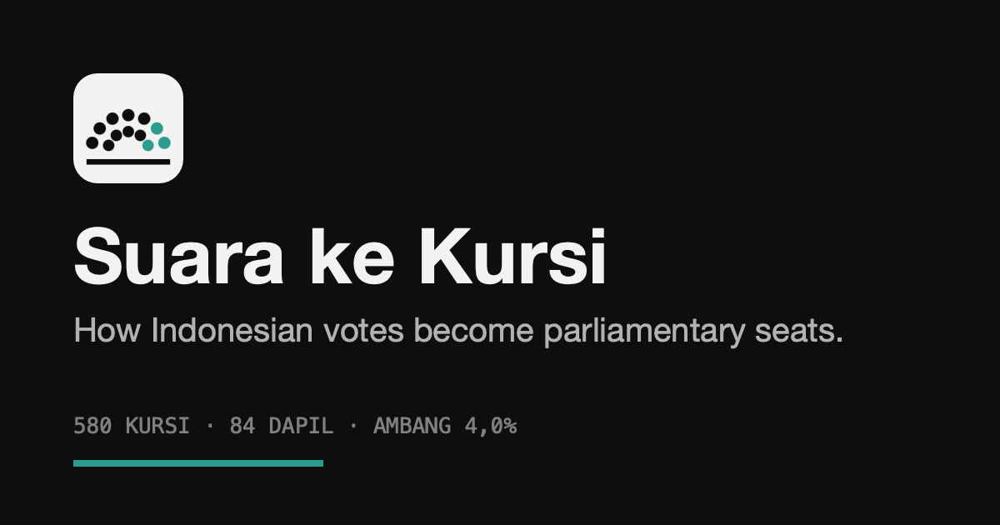

<div align="center">



<h1>Suara ke Kursi</h1>

**How Indonesian votes become parliamentary seats.**

A static, client-side app that reproduces the 2024 DPR allocation and lets anyone
change the rules and watch the chamber recompose on the same votes.

[**Live app**](https://andifathulms.github.io/seat-allocation/) ·
[PRD](PRD.md) · [Design](DESIGN.md) · [Build notes](CLAUDE.md) · [Decisions](DECISIONS.md)

[](https://github.com/andifathulms/seat-allocation/actions/workflows/ci.yml)
[](https://github.com/andifathulms/seat-allocation/actions/workflows/deploy.yml)


</div>

---

## The question

Indonesia elects 580 members of the DPR across 84 electoral districts. Votes become
seats through two rules almost nobody can actually perform: a 4% national threshold
(UU 7/2017 Pasal 414), and Sainte-Laguë highest averages applied district by district
(Pasal 415). Between them, 17.304.303 votes in 2024 produced no seat at all.

This app performs both rules in front of you, cites the pasal for each, and then lets
you change them.

## The state of the data, up front

> The certified dapil × party recapitulation was not available to this build.

Three of the four data files carry real figures — the eighteen parties' national valid
votes, which sum to **151.796.631** exactly; the **580** seats of Keputusan KPU
1206/2024; and the pasal citations. `public/data/dapil-2024.json` is a placeholder
generated by `scripts/extract/build-dapil.ts`, and says so at its root.

So `npm run verify` exits non-zero, and the app's header states that the official result
has **not** been reproduced rather than claiming that it has. Everything computed from
national figures is computed on real numbers: the threshold, the three disproportionality
indices, and the unconverted-vote total, which comes out at 17.304.303 — Perludem's
count, to the vote. Everything computed per dapil is not.

Dropping the certified file in place with `"provenance": "certified"` turns the gate
green and switches the header on its own. No code changes. See [DECISIONS.md](DECISIONS.md) §1.

## The five instruments

| View | What it shows |
|---|---|
| **Chamber** | A 580-seat hemicycle. Move the threshold and seats migrate between parties in one animation pass. |
| **Archipelago** | All 84 dapil as small multiples; a shape marks each one whose composition differs from the 2024 result. |
| **Vote bar** | The 151.796.631 valid votes, and the share of them that converts to nothing. |
| **Cascade** | The divisor table for one dapil, seat by seat, in the order each was claimed. |
| **Proportionality** | Vote share against seat share, with Gallagher, Loosemore–Hanby and ENP. |

Every instrument has a keyboard-reachable table equivalent. Colour is never the only
channel.

## The four knobs

| Knob | Range |
|---|---|
| Threshold | 0–10%, continuous |
| Threshold scope | national · per-dapil · none |
| Divisor | Sainte-Laguë · D'Hondt · modified Sainte-Laguë · Hare quota |
| Geography | 84 dapil · one national pool |

Every configuration serialises to the query string, so any argument about a 2%
threshold can be sent as a link:

```
?t=2.0&scope=national&d=sainte-lague&geo=dapil
```

## Running it

```bash
npm install
npm run dev          # http://localhost:5173
npm test             # engine tests, node environment, no DOM
npm run verify       # the reproduction gate
npm run typecheck
npm run build        # verify → typecheck → vite build
npm run data:build   # regenerates the dapil placeholder
npm run fonts:build  # copies the two self-hosted font files into public/fonts
```

## Layout

```
public/data/     the four JSON files; the app fetches nothing else, ever
public/brand/    favicon, app icons, share card
src/engine/      pure TypeScript, imports nothing, runs under node --test
src/data/        parse, validate, and compare against the official result
src/state/       the four rule knobs, serialised to the query string
src/views/       the five instruments
src/ui/          controls, metric strip, citations, tables, the motion loop
scripts/         the reproduction gate and the one-time extraction work
tests/           every expected value derived on paper in the comment above it
```

The engine is the whole point of the separation: `allocate(parties, dapil, rules)` is
synchronous, deterministic, and pure. A full 84-dapil recomputation takes **0,23 ms**,
which is why the threshold scrubber recomputes on every frame with no debounce, no
worker, and no request for idle time.

## Design in one paragraph

Reading matter sits on paper; every instrument sits on a near-black stage, which is the
one ground any party colour is ever drawn on and the ground the palette was solved
against. The interface itself has no colour — every saturated pixel on screen is data.
Both colour schemes ship. [DESIGN.md](DESIGN.md) §0.1 records why the first attempt at a
single mid-value ground had to be abandoned.

## What the app will not do

It reports what the arithmetic produces. It never says a result is unfair, never says a
party was cheated, and never recommends a threshold. Every rule cites its pasal and every
figure cites its KPU source.

Changing a rule recomputes seats on the fixed 2024 votes. That is arithmetic on a
counterfactual rule, not a simulation of a counterfactual election — voters and parties
behave strategically, and some people did not vote for a small party precisely because
they expected it to fail. The app says so, next to the controls, whenever any control is
off its 2024 default.

## Verified

- **40** engine tests, every expected value hand-computed.
- Full recomputation at **0,23 ms** median across a threshold sweep, against a 16 ms budget.
- Dragging the threshold from 4,0% to 0 on the production build: **60 fps** median, p95
  frame 17,6 ms, 1,3% of frames over 20 ms, no recomputation stall.
- **440 KB** shipped — code, data and the two font files — against a 1 MB budget.
- **Zero** axe-core violations against WCAG 2.1 A and AA at 380, 720 and 1400 px, in both
  colour schemes, with every table, disclosure and popover expanded.
- Reduced motion measured, not assumed: every instrument lands in one write.
- No horizontal overflow at 380, 480, 720, 900, 1200 or 1600 px; the hemicycle is legible
  at the narrowest of them.
- Every party colour clears **3,5:1** against the one ground it is ever drawn on, and seven
  parties — including the four largest — carry their logo colour unchanged.
  `npx tsx scripts/extract/solve-colors.ts` prints the whole table and exits non-zero if
  any colour falls under the floor.

## Sources

- **UU 7/2017** Pasal 414, 415 — the threshold and the allocation method.
- **Putusan MK 116/PUU-XXI/2023** — the conditions the Court attached to the threshold.
- **PKPU 6/2023** — the 84 dapil and their seat allocations.
- **Keputusan KPU 1206/2024** — the 580 elected members.
- **Keputusan KPU** on the national result, 20 March 2024 — valid votes per party.

Each is linked, with its pasal text, from the citation popovers in the app itself.

---

<div align="center">

Designed & built by [Andi Fathul Mukminin](https://andifathulms.github.io/en/)

[Portfolio](https://andifathulms.github.io/en/) ·
[GitHub](https://github.com/andifathulms) ·
[LinkedIn](https://www.linkedin.com/in/andifathulmukminin/) ·
[Instagram](https://www.instagram.com/andifathulms/)

</div>
